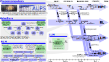

# x1 - A Reasoning Language Model Blueprint

<p align="center">
  
</p>

This is the official implementation of [Reasoning Language Models: A Blueprint](https://arxiv.org/abs/2501.11223).

x1 is an extensible and minimalist framework that can serve as ground to design and experiment with Reasoning Language Models (RLMs).
x1 provides currently one RLM example implementation, which employs a tree reasoning structure in conjunction with MCTS as the reasoning strategy.
This combination allows for a systematic exploration of reasoning paths while balancing exploration of new possibilities and exploitation of promising solutions judged by a value model.


## Pillars of Reasoning Language Models

This class of models has been the result of the development of three lines of works: (1) Reinforcement Learning based models such as
AlphaZero, (2) LLM and Transformer based models such as GPT-4o, and (3) the continuous growth of compute power and data processing capabilities of
supercomputers and high performance systems.

<p align="center">
  
</p>


## Setup Guide

In order to use this framework, you need to have a working installation of Python 3.11.5 or newer.


### Installing x1

Before running either of the following two installation methods, make sure to activate your Python environment (if any) beforehand.
If you are a user and you just want to use `x1`, you can install it from source:
```bash
git clone https://github.com/spcl/x1.git
cd x1
pip install .
```
If you are a developer and you want to modify the code, you can install it in editable mode from source:
```bash
git clone https://github.com/spcl/x1.git
cd x1
pip install -e .
```

## Documentation

The paper gives a high-level overview of the framework and its components.
In order to understand the framework in more detail, you can read the documentation of the individual components.
The [Strategy](x1/strategy/README.md) component discusses the reasoning structure and the reasoning strategy, specifically the way how x1 implements Monte Carlo Tree Search (MCTS).
The [Expansion](x1/expansion/README.md) component shows how a policy model or prompted step expansion can be used to generate new reasoning steps, implementing the generate structure transformation of the framework,
while the [Evaluation](x1/evaluation/README.md) component scores these reasoning steps, regardless whether they are intermediate or final reasoning steps, with the help of a value model or prompted step evaluation (implementing the evaluation transformation).
The [Synthetic Generation](x1/synthetic_generation/README.md) component describes the generation of synthetic reasoning tasks as well as the verification of model outputs for these tasks.
The [Benchmarking](x1/benchmarking/README.md) component provides tools and infrastructure for benchmarking Reasoning Language Models (RLMs).
The [Server](x1/server/README.md) components allows to host policy and value models on separate servers and implements batching for efficient querying of these models.


## Examples

The [examples](examples) directory contains several examples to illustrate certain aspects of the framework.
It is a great starting point for learning how to use the framework to solve real problems. As some examples need access to models, you need to start the [server](x1/server) components first.

The [datasets](datasets) directory contains example datasets for the four [reasoning domains](x1/synthetic_generation/README.md#domains) of the [Synthetic Generation](x1/synthetic_generation) component.


## Citations

If you find this repository valuable, please give it a star!
Got any questions or feedback? Feel free to reach out and open an issue.
Using this in your work? Please reference us using the provided citation:

```bibtex
@misc{besta2025reasoning,
  title = {{Reasoning Language Models: A Blueprint}},
  author = {Besta, Maciej and Barth, Julia and Schreiber, Eric and Kubicek, Ales and Catarino, Afonso and Gerstenberger, Robert and Nyczyk, Piotr and Iff, Patrick and Li, Yueling and Houliston, Sam and Sternal, Tomasz and Copik, Marcin and Kwa\'{s}niewski, Grzegorz and Müller, Jürgen and Flis, Łukasz and Eberhard, Hannes and Niewiadomski, Hubert and Hoefler, Torsten},
  year = 2025,
  month = Jan,
  eprinttype = {arXiv},
  eprint = {2501.11223}
}
```
