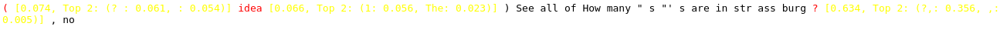
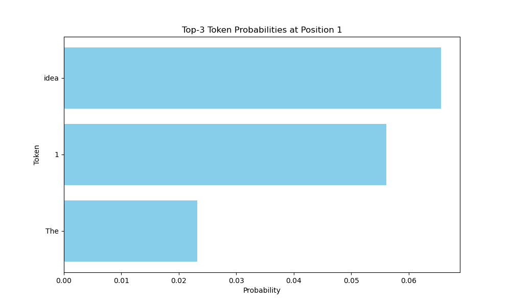

# Tools for Token Analysis

This directory provides tools for the analysis of single tokens.
The code discussed below can be found in the file [token_level.py](token_level.py).

## Data Generation

The function `generate_with_top_k_tracking` generates for a given prompt a model output with at most `max_length` tokens and additionally stores the logits and probabilities for the top `k` tokens at each position.
The function returns the generated output as well as a dictionary with the token information in the following format:
```python
[
    {
        "text": str,
        "logit": float,
        "probability": float,
        "top_k: [
            {
                "text": str,
                "logit": float,
                "probability": float,
            },
            ...
        ]
    },
    ...
]
```

The whole data structure is stored as a JSON structure, which additionally stores the prompt as well as the full generated output in the following format:
```python
{
    "prompt": str,
    "generated_text": str,
    "tokens_info": [
        {
            "text": str,
            "logit": float,
            "probability": float,
            "top_k: [
                {
                    "text": str,
                    "logit": float,
                    "probability": float,
                },
                ...
            ]
        }
    ],
    ...
}
```
In order to use the data generation functionality, the path to the model needs to be initialized in line 230 of the file [token_level.py](token_level.py#L230).


## Analysis Tools

We provide an example sample for the prompt `How many "s"'s are in strassburg?` in the file [example.json](example.json), that was used to generate the different visualization styles found below.


### Print Top k Tokens

You can print the prompt, the generated output as well as the top k token for each position with the `print_full_info` function.
An example output for the top 3 tokens for the first three positions is shown below:
```
Generated Text Sequence:
Input: How many "s"'s are in strassburg?
Output:  (idea)
See all of How many "s"'s are in strassburg?, no


Position 1:
  Chosen Token: ' (' (Logit: 12.8828125, Probability: 0.07427436858415604)
  Top-3 Alternatives:
    - Token: '?
' (Logit: 12.6796875, Probability: 0.060620974749326706)
    - Token: ' ' (Logit: 12.5703125, Probability: 0.054340288043022156)


Position 2:
  Chosen Token: 'idea' (Logit: 12.421875, Probability: 0.06562700867652893)
  Top-3 Alternatives:
    - Token: '1' (Logit: 12.265625, Probability: 0.056133754551410675)
    - Token: 'The' (Logit: 11.3828125, Probability: 0.023217929527163506)


Position 3:
  Chosen Token: ')
' (Logit: 19.84375, Probability: 0.9707984328269958)
  Top-3 Alternatives:
    - Token: ')' (Logit: 14.8984375, Probability: 0.006908871699124575)
    - Token: ' for' (Logit: 14.5234375, Probability: 0.004748393781483173)
```


### Output Top k Tokens and Their Probabilities

The function `html_with_low_prob_highlighting` formats the generated model output in html with high probability tokens marked as black.
Low probability tokens are marked in red and their probability is displayed as well as the tokens and their probabilities of the other top k.
What constitutes a high probability token can be influenced with the `threshold` parameter.
An output for the same sample as above is shown in full below:

---

<!--
# Markdown does not properly render text colors, so use a screenshot instead.
<p style='font-family: monospace'><span style='color: red'> (</span> <span style='color: yellow'>[0.074, Top 2: (?
: 0.061,  : 0.054)]</span> <span style='color: red'>idea</span> <span style='color: yellow'>[0.066, Top 2: (1: 0.056, The: 0.023)]</span> )
 See  all  of  How  many  " s "' s  are  in  str ass burg <span style='color: red'>?</span> <span style='color: yellow'>[0.634, Top 2: (?,: 0.356, ,: 0.005)]</span> ,  no </p>
-->

<p align="center">
	
</p>

---


### Top k Token and Probability Visualization

The probabilities of the top k tokens for a given position in the generated model output can visualized with the function `plot_top_k_probabilities`.
An example is shown below:
<p align="center">
	
</p>
